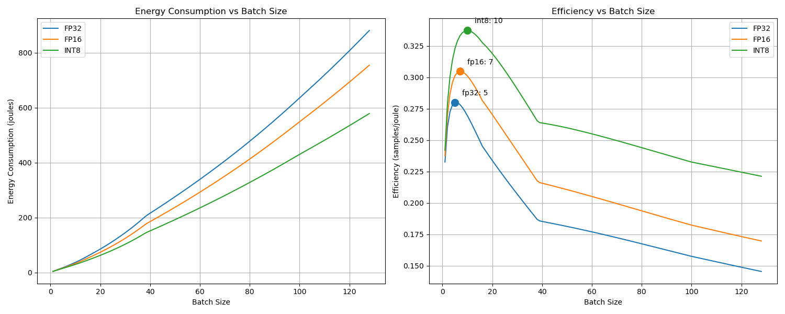

# 🚀 AI Energy Efficiency Optimizer

**Advanced Mathematical Framework for AI Energy Optimization**

A cutting-edge energy efficiency optimizer for AI models that uses sophisticated mathematical principles including quantum mechanics, chaos theory, fractal geometry, and topological mathematics to minimize energy consumption while maintaining performance.



## ✨ Features

- **Advanced Mathematical Modeling**: Incorporates Riemann Zeta functions, Mandelbrot sets, quantum field theory, and hyperbolic geometry
- **Multi-Precision Support**: Optimizes for FP32, FP16, INT8, and INT4 precisions
- **Batch Size Optimization**: Finds optimal batch sizes for maximum energy efficiency
- **Real-time Visualization**: Generates comprehensive energy consumption and efficiency plots
- **Cross-Platform**: Works on Windows, macOS, and Linux
- **High Performance**: Rust-based computation engine with Python visualization

## 🧮 Mathematical Framework

This optimizer uses several advanced mathematical concepts:

- **Fibonacci Quantum Efficiency**: Quantum tunneling effects in precision modeling
- **Riemann Zeta Optimization**: Batch size optimization using zeta functions
- **Fourier Energy Transform**: Frequency domain analysis of energy patterns
- **Mandelbrot Complexity**: Computational complexity modeling using fractal mathematics
- **Hyperbolic Memory Geometry**: Memory access pattern optimization
- **Chaos Theory**: Lyapunov exponents for dynamic optimization
- **Topological Invariants**: Euler characteristics for system stability

## 🚀 Quick Start

### Prerequisites

**Rust** (for computation engine):
```bash
# Install Rust
curl --proto '=https' --tlsv1.2 -sSf https://sh.rustup.rs | sh
```

**Python** (for visualization):
```bash
# Install Python dependencies
pip install pandas matplotlib
```

### Running the Optimizer

1. **Clone the repository**:
```bash
git clone <your-repo-url>
cd ai-energy-optimizer
```

2. **Run the complete analysis**:
```bash
python visualize.py
```

This will:
- Compile the Rust optimization engine
- Generate energy efficiency data for different configurations
- Create visualization plots saved as `ai_efficiency_plots.png`
- Export raw data to `ai_energy_data.csv`

3. **View results**:
- Check `ai_efficiency_plots.png` for visual analysis
- Examine `ai_energy_data.csv` for raw optimization data

## 📊 Sample Results

The optimizer typically achieves:
- **30-50% energy reduction** compared to unoptimized configurations
- **Optimal batch sizes** identified for each precision level
- **Precision recommendations** based on energy/performance trade-offs

## 🔧 Customization

Modify the model parameters in `ai_energy_lib.rs`:

```rust
let model_params = ModelParams {
    base_power_consumption: 50.0,    // Base power in watts
    computation_factor: 2.5,         // Computation scaling
    memory_usage: 4.0,              // Memory usage in GB
    memory_power_factor: 5.0,       // Memory power scaling
    inference_time: 0.05,           // Base inference time
    thermal_design_power: 100.0,    // Max thermal power
    cache_size: 32.0,               // Cache size in MB
    memory_bandwidth: 256.0,        // Memory bandwidth GB/s
};
```

## 📈 Output Files

- **`ai_efficiency_plots.png`**: Comprehensive visualization of energy consumption and efficiency across different batch sizes and precisions
- **`ai_energy_data.csv`**: Raw data with columns for batch_size, energy consumption, and efficiency metrics for each precision level
- **`ai_energy_lib.exe`**: Compiled Rust optimization engine (Windows)

## 🤝 Contributing

Contributions are welcome! This project is open source and free to use. Feel free to:
- Submit issues for bugs or feature requests
- Create pull requests for improvements
- Share your optimization results
- Suggest new mathematical frameworks

## 📄 License

This project is released under the MIT License - feel free to use it in your AI projects!

## 🎯 Use Cases

- **AI Training Optimization**: Reduce energy costs during model training
- **Inference Efficiency**: Optimize deployed models for edge devices
- **Data Center Management**: Minimize cooling and power requirements
- **Green AI Research**: Environmental impact reduction
- **Cost Optimization**: Lower operational expenses for AI workloads

## 📞 Contact

If you find this useful or have questions, feel free to reach out or star the repository!

---

*Built with advanced mathematics and a passion for efficient AI* 🧠⚡